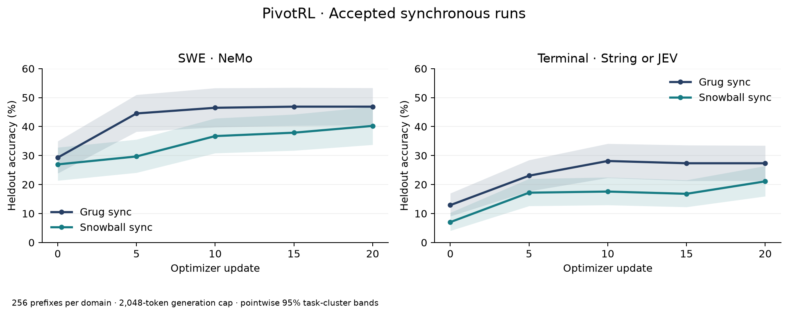
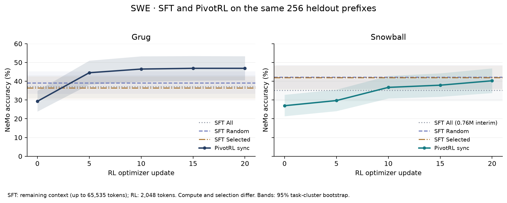

# PivotRL: Grug and Snowball next-action experiments

Synchronous PivotRL improved heldout next-action accuracy for both checkpoints on
SWE and Terminal. SWE uses the released NeMo argument comparator; Terminal uses
string similarity or JEV equivalence. These are action-level rewards, not task
completion rates.



| Condition | Selected prefixes | H100 GPUs | Initial → update 20 | Final 95% interval |
| --- | ---: | ---: | ---: | ---: |
| SWE Grug / NeMo | 1,844 | 112 | 29.3% → 46.9% | 40.5–53.4% |
| SWE Snowball / NeMo | 1,199 | 112 | 27.0% → 40.2% | 33.7–46.9% |
| Terminal Grug / string-or-JEV | 3,063 | 64 | 12.9% → 27.3% | 21.3–33.5% |
| Terminal Snowball / string-or-JEV | 265 | 64 | 7.0% → 21.1% | 16.0–26.4% |

Each RL update uses 64 prefixes × 8 sampled actions, a 2,048-token generation cap,
GRPO, AdamW at 4e-6, and forward KL with coefficient 0.01. The NeMo conditions
place policy, reference, and generation on 48 + 48 + 16 GPUs. Terminal colocates
policy and reference on 48 GPUs and uses 16 generation GPUs. Snowball uses the
Grug training config with its own frozen selected dataset. The accepted runs
have complete grading and zero observed staleness; the Terminal Snowball result
comes from the fresh rerun that resolved the earlier grading failures.

The Grug SWE curve combines the initial run through update 15 with its accepted
resume using separate reference placement and eager policy execution. Its archived
final launch resumes update 15. A fresh run of that final config tests the same
scientific settings, but does not reconstruct that hardware/recovery history.



| SWE checkpoint | SFT All | SFT Random | SFT Selected | PivotRL update 20 |
| --- | ---: | ---: | ---: | ---: |
| Grug | 37.1% | 39.1% | 36.3% | 46.9% |
| Snowball | 35.2% | 42.2% | 41.8% | 40.2% |

SFT trains on the demonstrated next action, including tool formatting and the end
marker, with prompt tokens masked. SWE conditions target 1M loss tokens; Snowball
All is an interim evaluation at 759,168 tokens. SWE SFT permits remaining-context
generation, up to 65,535 tokens, while RL uses 2,048. Selection and compute also
differ, so the table is descriptive. Four Terminal SFT All/Selected configs are
archived too; their evaluation cap is 1,024 and their recorded string/exact scores
are distinct from the RL string-or-JEV metric.

The holdouts have 256 prefixes each, covering 154 SWE tasks and 164 Terminal tasks.
Confidence bands resample whole tasks with all their prefixes, using 10,000 draws
and seed 42. They are pointwise intervals over heldout tasks, not uncertainty across
training seeds. Every SWE demonstrated target is already ≤1,024 tokens under both
frozen chat formats (maxima: Grug 972, Snowball 985), so another subset panel would
contain the same examples.

## Frozen selection

Each selected prefix has a saved pass and failure under its own initial checkpoint,
reward, and capped completed-action rule. The [selection receipts](experiments/selection/)
include immutable dataset hashes and score provenance. The accompanying witnesses
include the eight outcomes, a known-pass record ID, a known-failure record ID, and a
strictly positive lower bound on reward variance.

Terminal has partially unresolved saved judge outcomes in 939 Grug groups and 36
Snowball groups. Those groups still have known passes and failures; every possible
assignment of the missing outcomes preserves positive variance. Missing outcomes
are never counted as failures. Responses beyond the cap are failures under the
completed-action rule; ambiguous cap/EOS boundaries and overlong prompts are excluded.
No new generation or judge requests were needed for selection. Future stochastic
training groups can be uniform; the invariant concerns the saved selection evidence.

The new Snowball runs avoided the earlier asynchronous collapse. The reruns changed
the complete training config, so they do not isolate asynchronous execution as its
cause. See [the method](method.md), [SFT](sft.md), and [verifiers](verifiers.md) for the
code contracts.

## Reproduce

[manifest.json](experiments/manifest.json) indexes 14 exact archived launches: six
SWE SFT conditions, four Terminal SFT conditions, and the four accepted synchronous
RL conditions. It records model/tokenizer revisions, dataset identities, original
launcher commits, and observed budgets. Outputs and resume paths in those snapshots
refer to the recorded runs.

Create a fresh, locally validated launch with a new run ID and artifact root:

```bash
uv sync --frozen --group dev --group harbor-test --extra cpu --extra telemetry
uv run python scripts/pivotrl/prepare_run.py swe-snowball-rl-sync \
  --run-id pivot-swe-snowball-reproduction \
  --output-root s3://YOUR-BUCKET/YOUR-PREFIX/pivot-swe-snowball-reproduction \
  --cluster-config /path/to/iris-cluster.yaml \
  --output /tmp/pivot-swe-snowball-reproduction.yaml
```

The helper preserves scientific settings and frozen inputs, clears resume state and the recorded heldout baseline cache,
uses this checkout's committed launcher revision, and selects preparation mode.
It submits nothing. Review the prepared config, then set `run.submission: detach`
and use `uv run python -m cloud.iris.launch iris launch --config /tmp/pivot-swe-snowball-reproduction.yaml`
to launch. The cluster needs the pinned models and CoreWeave dataset objects;
Terminal string-or-JEV additionally needs `OPENROUTER_API_KEY`. Check data bytes
against the identities in the manifest before training.

The branch is based on newer main than the recorded runs. Its CPU tests cover
config composition, objectives, selection, and publication; a new GPU run is needed
to validate that runtime. The snapshots retain original launcher revisions for
reconstructing the recorded environment or continuing a recorded checkpoint.

Regenerate both figures and their confidence bands locally from the included
numeric predictions and accepted SFT grade tables:

```bash
uv run python scripts/pivotrl/plot_results.py
```

[evaluation-scores.json](experiments/evaluation-scores.json) contains source/task
IDs and rewards, with original prediction URIs and SHA-256 hashes. It contains no
prompts or generated responses. PNG and SVG figures are included for review and
reuse. [target-action-lengths.json](experiments/target-action-lengths.json) records
the tokenizer hashes and per-example target lengths.
